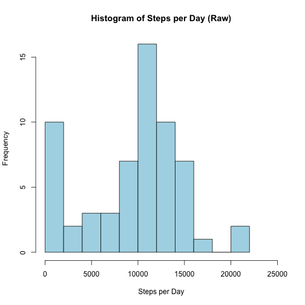
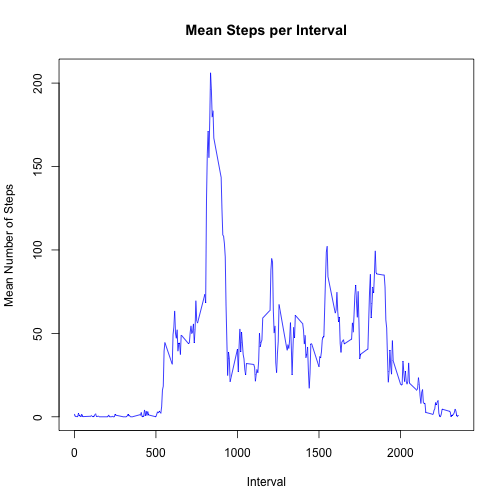
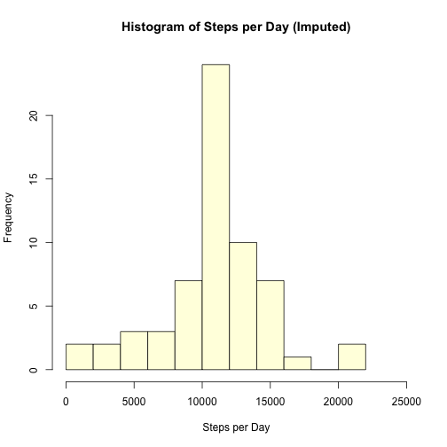
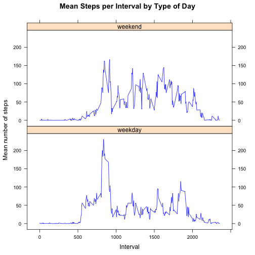

Reproducible Research
----------------------

The [Reproducible Research](https://class.coursera.org/repdata-004) course is part
of the [Data Science Specialization](https://www.coursera.org/specialization/jhudatascience/1?utm_medium=listingPage) offered by John Hopkins University on Coursera.

### Peer Assessment 1

In this file, I document my code and its output in order to answer the questions associated with [Peer Assessment 1](https://class.coursera.org/repdata-004/human_grading/view/courses/972143/assessments/3/submissions).

***
#### Loading and preprocessing the data

The data for this assignment can be downloaded from the Peer Assessment link above.  For completeness, I include the link to the data set here:  [Activity monitoring data [52K]](https://d396qusza40orc.cloudfront.net/repdata%2Fdata%2Factivity.zip).

The data was sourced from a personal activity monitoring device. The device collected data at 5 minute intervals through out the day. The data consists of two months of data from an anonymous individual collected during the months of October and November, 2012.  The data includes the number of steps taken in 5 minute intervals each day.

The variables included in this dataset are:

```
Variable | Description
---------|-------------------------------------------------------------------------------
steps    | number of steps taking in a 5-minute interval (missing values are coded as NA)
         |
date     | the date on which the measurement was taken in YYYY-MM-DD format
         |
interval | identifier for the 5-minute interval in which measurement was taken
```

The dataset is stored in a comma-separated-value (CSV) file and there are a total of 17,568 observations in this dataset.

***
### My Analysis

For my analysis, data.table is a required package.  The data is unzipped and stored in a local directory.  It is read from the directory and stored in a data table called "activity".


```r
require(data.table)
```

```
## Loading required package: data.table
## data.table 1.9.2  For help type: help("data.table")
```

```r
setwd("~/Documents/Coursera/5_Reproducible Research")
activity <- fread("activity.csv", header = TRUE, stringsAsFactors = FALSE)
```

I will clean up the "activity" data table to suit my needs by re-ordering the columns, re-classing the date data to date format and reclassing the steps data to numeric format.  Finally, I key the data table by date and interval.


```r
setcolorder(activity, c("date", "interval", "steps"))
activity$date <- activity[, as.Date(date)]
activity$steps <- activity[, as.numeric(steps)]
setkey(activity, date, interval)
```

After cleaning, the "activity" data table looks like this...


```r
str(activity)
```

```
## Classes 'data.table' and 'data.frame':	17568 obs. of  3 variables:
##  $ date    : Date, format: "2012-10-01" "2012-10-01" ...
##  $ interval: int  0 5 10 15 20 25 30 35 40 45 ...
##  $ steps   : num  NA NA NA NA NA NA NA NA NA NA ...
##  - attr(*, ".internal.selfref")=<externalptr> 
##  - attr(*, "sorted")= chr  "date" "interval"
```

```r
head(activity)
```

```
##          date interval steps
## 1: 2012-10-01        0    NA
## 2: 2012-10-01        5    NA
## 3: 2012-10-01       10    NA
## 4: 2012-10-01       15    NA
## 5: 2012-10-01       20    NA
## 6: 2012-10-01       25    NA
```

```r
tail(activity)
```

```
##          date interval steps
## 1: 2012-11-30     2330    NA
## 2: 2012-11-30     2335    NA
## 3: 2012-11-30     2340    NA
## 4: 2012-11-30     2345    NA
## 5: 2012-11-30     2350    NA
## 6: 2012-11-30     2355    NA
```

***
#### Question Set 1: What is the mean total number of steps taken per day?
1. Make a histogram of the total number of steps taken each day
2. Calculate and report the mean and median total number of steps taken per day.

To address these questions, I first create a data table called "steps_per_day" from the "activity" data table.  The data table will have two columns: the date and the sum of the steps data for each day.


```r
steps_per_day <- activity[, sum(steps, na.rm = TRUE), by = date]
setnames(steps_per_day, c("date", "steps"))
setkey(steps_per_day, date)
str(steps_per_day)
```

```
## Classes 'data.table' and 'data.frame':	61 obs. of  2 variables:
##  $ date : Date, format: "2012-10-01" "2012-10-02" ...
##  $ steps: num  0 126 11352 12116 13294 ...
##  - attr(*, "sorted")= chr "date"
##  - attr(*, ".internal.selfref")=<externalptr>
```

```r
head(steps_per_day)
```

```
##          date steps
## 1: 2012-10-01     0
## 2: 2012-10-02   126
## 3: 2012-10-03 11352
## 4: 2012-10-04 12116
## 5: 2012-10-05 13294
## 6: 2012-10-06 15420
```

Next, I call the hist() function in data table format to create a histogram of the data.  Note I increase the granularity of the histogram by setting breaks equal to 10, which is twice the default break count.


```r
steps_per_day[, hist(steps, breaks = 10, freq = TRUE,
                     xlab="Steps per Day", main="Histogram of Steps per Day (Raw)", 
                     col="lightblue", xlim = c(0, 25000))]
```

 

```
## $breaks
##  [1]     0  2000  4000  6000  8000 10000 12000 14000 16000 18000 20000
## [12] 22000
## 
## $counts
##  [1] 10  2  3  3  7 16 10  7  1  0  2
## 
## $density
##  [1] 8.197e-05 1.639e-05 2.459e-05 2.459e-05 5.738e-05 1.311e-04 8.197e-05
##  [8] 5.738e-05 8.197e-06 0.000e+00 1.639e-05
## 
## $mids
##  [1]  1000  3000  5000  7000  9000 11000 13000 15000 17000 19000 21000
## 
## $xname
## [1] "steps"
## 
## $equidist
## [1] TRUE
## 
## attr(,"class")
## [1] "histogram"
```

Last, I call the mean() and median() functions on the "steps_per_day" data table to calculate the mean and median total steps per day.


```r
mean_steps <- steps_per_day[, round(mean(steps, 0))]
median_steps <- steps_per_day[, round(median(steps, 0))]
```

**The mean total steps per day is: 9354 steps.  The median total steps per day is: 10395 steps.**

***
#### Question Set 2: What is the average daily activity pattern?
1. Make a time series plot of the 5-minute interval (x-axis) and the average number of steps taken, averaged across all days(y-axis).
2. Which 5-minute interval, on average across all the days in the dataset, contains the maximum number of steps?.

To address these questions, I first create a data table called "interval_plot" from the "activity" data table.  The data table will have two columns: the interval and the mean of the steps per interval across each day in the dataset.


```r
interval_plot <- activity[, mean(steps, na.rm = TRUE), by = interval]
setnames(interval_plot, c("interval", "steps"))
setkey(interval_plot, interval)
str(interval_plot)
```

```
## Classes 'data.table' and 'data.frame':	288 obs. of  2 variables:
##  $ interval: int  0 5 10 15 20 25 30 35 40 45 ...
##  $ steps   : num  1.717 0.3396 0.1321 0.1509 0.0755 ...
##  - attr(*, ".internal.selfref")=<externalptr> 
##  - attr(*, "sorted")= chr "interval"
```

```r
head(interval_plot)
```

```
##    interval   steps
## 1:        0 1.71698
## 2:        5 0.33962
## 3:       10 0.13208
## 4:       15 0.15094
## 5:       20 0.07547
## 6:       25 2.09434
```

Next, I call the plot() function in data table notation to create a simple line plot of the mean number of steps versus the interval. 


```r
interval_plot[, plot(interval, steps, type = "l", col = "blue",
                     main = "Mean Steps per Interval", xlab = "Interval",
                     ylab = "Mean Number of Steps")]
```

 

```
## NULL
```

Last, I find the index of the record in the "plot_interval" data table that has the maximum number of steps.  I report this record.


```r
find_max <- interval_plot[, which.max(steps)]
```

**Record number 104 contains the maximum number of steps per interval.  This represents interval 835 with 206 steps.**

***
#### Question Set 3: Imputing missing values
1. Calculate and report the total number of missing values in the dataset.
2. Devise a strategy for filling in all of the missing values in the dataset.
3. Create a new dataset that is equal to the original dataset with the missing data filled in.
4. Make a histogram of the total number of steps taken each day.
5. Calculate and report the mean and median total number of steps taken per day. 

It is a relatively simple matter to find and report the number of missing values using the is.na() function.  I also calculate and report the number of missing values as a fraction of the total dataset.


```r
missing <- activity[, sum(is.na(steps))]
missing_fraction <- missing/nrow(activity)*100
```

**There are 2304 missing values in the data set or about 13 % of the total.**

I can use the "interval_plot" data table I made earlier as a look-up table to fill in the missing values in the original dataset.  Recall that the "interval_plot" data table contains the mean number of steps per interval.  I will use the mean steps data in this table to replace missing values in a copy of the "activity" data table called "activity_full".

Note the missing values in "activity_full".


```r
activity_full <- activity # copy the "activity" data table
head(activity_full)
```

```
##          date interval steps
## 1: 2012-10-01        0    NA
## 2: 2012-10-01        5    NA
## 3: 2012-10-01       10    NA
## 4: 2012-10-01       15    NA
## 5: 2012-10-01       20    NA
## 6: 2012-10-01       25    NA
```

```r
tail(activity_full)
```

```
##          date interval steps
## 1: 2012-11-30     2330    NA
## 2: 2012-11-30     2335    NA
## 3: 2012-11-30     2340    NA
## 4: 2012-11-30     2345    NA
## 5: 2012-11-30     2350    NA
## 6: 2012-11-30     2355    NA
```

The followng code looks after this.


```r
j <- match("steps", names(activity_full)) # get the column index for activity_full$steps

for(i in 1:nrow(activity_full)) {
  if (is.na(activity_full[i, steps])) {  
    int <- activity_full[i, interval] # for missing data, get the interval
    find_int <- interval_plot[, match(int, interval_plot$interval)] # find the interval in the interval_plot data table
    int_steps <- interval_plot[find_int, steps] # find the mean steps for that interval
    activity_full[i, j] <- int_steps # replace the missing data in the activity_full data table with the mean steps
    }
  }  
```

The activity_full data table now has all missing values populated with the mean number of steps for the corresponding interval.


```r
head(activity_full)
```

```
##          date interval   steps
## 1: 2012-10-01        0 1.71698
## 2: 2012-10-01        5 0.33962
## 3: 2012-10-01       10 0.13208
## 4: 2012-10-01       15 0.15094
## 5: 2012-10-01       20 0.07547
## 6: 2012-10-01       25 2.09434
```

```r
tail(activity_full)
```

```
##          date interval  steps
## 1: 2012-11-30     2330 2.6038
## 2: 2012-11-30     2335 4.6981
## 3: 2012-11-30     2340 3.3019
## 4: 2012-11-30     2345 0.6415
## 5: 2012-11-30     2350 0.2264
## 6: 2012-11-30     2355 1.0755
```

I can re-use code from earlier to create the histogram and report the new mean and median by applying the code to the new "activity_full" data table.


```r
steps_per_day_full <- activity_full[, sum(steps, na.rm = TRUE), by = date]
setnames(steps_per_day_full, c("date", "steps"))
setkey(steps_per_day_full, date)

steps_per_day_full[, hist(steps, breaks = 10, freq = TRUE,
                     xlab="Steps per Day", main="Histogram of Steps per Day (Imputed)", 
                     col="lightyellow", xlim = c(0, 25000))]
```

 

```
## $breaks
##  [1]     0  2000  4000  6000  8000 10000 12000 14000 16000 18000 20000
## [12] 22000
## 
## $counts
##  [1]  2  2  3  3  7 24 10  7  1  0  2
## 
## $density
##  [1] 1.639e-05 1.639e-05 2.459e-05 2.459e-05 5.738e-05 1.967e-04 8.197e-05
##  [8] 5.738e-05 8.197e-06 0.000e+00 1.639e-05
## 
## $mids
##  [1]  1000  3000  5000  7000  9000 11000 13000 15000 17000 19000 21000
## 
## $xname
## [1] "steps"
## 
## $equidist
## [1] TRUE
## 
## attr(,"class")
## [1] "histogram"
```

```r
mean_steps <- steps_per_day_full[, round(mean(steps,0))]

median_steps <- steps_per_day_full[, round(median(steps,0))]
```

**The mean total steps per day for the imputed dataset is: 10766 steps.  The median total steps per day for the imputed dataset is: 10766 steps.**

By inspection of the histograms and the summary data before and after imputation, it is clear that the imputation process has reduced the skewness in the data.  The mean and median number of steps per day are equal following imputation.

***
#### Question Set 4: Are there differences in activity patterns between weekdays and weekends?
1. Create a new factor variable in the dataset with two levels - "weekday" and "weekend" indicating whether a given date is a weekday or a weekend day.
2. Make a panel plot containing a time series plot of the 5-minute interval (x-axis) and the average number of steps taken, averaged across all weekday days or weekend days (y-axis).

First, I use the weekdays() function to set and populate a new column in "activity_full" with the name of the weekday for each record in the data table.  Then, I set and populate a new factor variable called day_type for each record that identifies the type of day - weekend or weekday.


```r
activity_full[, day:= weekdays(date)]
```

```
##              date interval   steps    day
##     1: 2012-10-01        0 1.71698 Monday
##     2: 2012-10-01        5 0.33962 Monday
##     3: 2012-10-01       10 0.13208 Monday
##     4: 2012-10-01       15 0.15094 Monday
##     5: 2012-10-01       20 0.07547 Monday
##    ---                                   
## 17564: 2012-11-30     2335 4.69811 Friday
## 17565: 2012-11-30     2340 3.30189 Friday
## 17566: 2012-11-30     2345 0.64151 Friday
## 17567: 2012-11-30     2350 0.22642 Friday
## 17568: 2012-11-30     2355 1.07547 Friday
```

```r
activity_full[, day_type := as.factor(ifelse(day == "Saturday" | day == "Sunday", "weekend", "weekday"))]
```

```
##              date interval   steps    day day_type
##     1: 2012-10-01        0 1.71698 Monday  weekday
##     2: 2012-10-01        5 0.33962 Monday  weekday
##     3: 2012-10-01       10 0.13208 Monday  weekday
##     4: 2012-10-01       15 0.15094 Monday  weekday
##     5: 2012-10-01       20 0.07547 Monday  weekday
##    ---                                            
## 17564: 2012-11-30     2335 4.69811 Friday  weekday
## 17565: 2012-11-30     2340 3.30189 Friday  weekday
## 17566: 2012-11-30     2345 0.64151 Friday  weekday
## 17567: 2012-11-30     2350 0.22642 Friday  weekday
## 17568: 2012-11-30     2355 1.07547 Friday  weekday
```

```r
setkey(activity_full, date, interval)
str(activity_full)
```

```
## Classes 'data.table' and 'data.frame':	17568 obs. of  5 variables:
##  $ date    : Date, format: "2012-10-01" "2012-10-01" ...
##  $ interval: int  0 5 10 15 20 25 30 35 40 45 ...
##  $ steps   : num  1.717 0.3396 0.1321 0.1509 0.0755 ...
##  $ day     : chr  "Monday" "Monday" "Monday" "Monday" ...
##  $ day_type: Factor w/ 2 levels "weekday","weekend": 1 1 1 1 1 1 1 1 1 1 ...
##  - attr(*, ".internal.selfref")=<externalptr> 
##  - attr(*, "sorted")= chr  "date" "interval"
```

Second, I create temporary data tables for manipulating the data to make it easy to plot.  Each data table is a subset of the "activity_full" data table, subsetted by the type of day.  For each data table, I calculate the mean steps per interval for each interval.  Then I combine the data tables into a single data table called "interval_plot_full".  I remove the temporary tables.


```r
a <- subset(activity_full, day_type == "weekend")
interval_plot_a <- a[, mean(steps, na.rm = TRUE), by = interval]
setnames(interval_plot_a, c("interval", "steps"))
interval_plot_a[, day_type := "weekend"]
```

```
##      interval     steps day_type
##   1:        0  0.214623  weekend
##   2:        5  0.042453  weekend
##   3:       10  0.016509  weekend
##   4:       15  0.018868  weekend
##   5:       20  0.009434  weekend
##  ---                            
## 284:     2335 11.587264  weekend
## 285:     2340  6.287736  weekend
## 286:     2345  1.705189  weekend
## 287:     2350  0.028302  weekend
## 288:     2355  0.134434  weekend
```

```r
b <- subset(activity_full, day_type == "weekday")
interval_plot_b <- b[, mean(steps, na.rm = TRUE), by = interval]
setnames(interval_plot_b, c("interval", "steps"))
interval_plot_b[, day_type := "weekday"]
```

```
##      interval   steps day_type
##   1:        0 2.25115  weekday
##   2:        5 0.44528  weekday
##   3:       10 0.17317  weekday
##   4:       15 0.19790  weekday
##   5:       20 0.09895  weekday
##  ---                          
## 284:     2335 2.24864  weekday
## 285:     2340 2.24025  weekday
## 286:     2345 0.26331  weekday
## 287:     2350 0.29686  weekday
## 288:     2355 1.41006  weekday
```

```r
interval_plot_full <- rbind(interval_plot_a, interval_plot_b)

rm(a, b, interval_plot_a, interval_plot_b)
```

Using lattice graphics, it is a simple matter to plot the 5-minute intervals and the average number of steps taken, averaged across all weekday days or weekend days.


```r
require(lattice)
```

```
## Loading required package: lattice
```

```r
xyplot( steps ~ interval | day_type, data = interval_plot_full, type = "l", col = "blue",
        scales = list(x = list(alternating = 1), y = list(alternating = 3)),
        layout = c(1,2),
         main = "Mean Steps per Interval by Type of Day",
        xlab = "Interval", ylab = "Mean number of steps"
      )
```

 

There are differences in the activity patterns between weekdays and weekends.  We don't know anything about the test subject so it is difficult to draw any conclusions beyond this simple generalization.

***

*That concludes the assignment.  Thanks for your time!*

